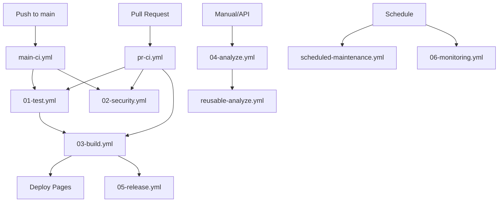

# GitHub Actions Workflows

This directory contains the CI/CD workflows for CPPCheck Studio. The workflows have been reorganized for better maintainability and performance.

## 🏗️ Workflow Structure

### Core Workflows (Numbered for Order)

1. **`01-test.yml`** - Comprehensive test suite
   - TypeScript tests with coverage
   - Python linting and testing
   - Integration tests
   - Matrix testing across Node/Python versions

2. **`02-security.yml`** - Security scanning
   - Dependency vulnerability scanning (Trivy)
   - Code security analysis (CodeQL)
   - Secret detection (TruffleHog, Gitleaks)
   - License compliance checks
   - SAST with Semgrep

3. **`03-build.yml`** - Build and validation
   - TypeScript package building
   - Python script validation
   - Workflow file validation
   - Format checking

4. **`04-analyze.yml`** - Repository analysis
   - Main entry point for C++ analysis
   - Validates inputs and calls reusable workflow
   - Handles both manual and API triggers

5. **`05-release.yml`** - Automated releases
   - Semantic versioning
   - NPM publishing
   - GitHub releases
   - Release notes generation

6. **`06-monitoring.yml`** - Metrics and health
   - Workflow performance metrics
   - Health checks
   - Failure alerts
   - Resource usage tracking

7. **`07-e2e-tests.yml`** - End-to-end testing
   - Playwright browser tests
   - Visual regression testing
   - Multi-browser support
   - Accessibility checks

8. **`08-performance.yml`** - Performance testing
   - Analysis benchmarking
   - Dashboard load time testing
   - Performance regression detection
   - Stress testing

9. **`09-api-tests.yml`** - API testing
   - Endpoint validation
   - JSON schema validation
   - Contract testing
   - Security testing

10. **`10-preview-deploy.yml`** - PR preview deployments
    - Automatic preview environments
    - Lighthouse analysis
    - Preview cleanup on PR close
    - Deployment status tracking

11. **`11-changelog.yml`** - Changelog management
    - Automated changelog generation
    - Release notes creation
    - Conventional commits parsing
    - PR-based changelog updates

12. **`12-multi-platform.yml`** - Cross-platform testing
    - Windows, Linux, macOS testing
    - Multi-version Node.js/Python
    - Docker multi-arch builds
    - Browser compatibility matrix

13. **`13-cost-tracking.yml`** - Cost optimization
    - Actions usage tracking
    - Cost analysis and reporting
    - Cache optimization
    - Performance metrics

### Orchestrator Workflows

- **`main-ci.yml`** - Main branch CI pipeline
  - Runs test → security → build → deploy
  - Handles GitHub Pages deployment
  - Checks for releases

- **`pr-ci.yml`** - Pull request validation
  - PR title validation
  - Size checks
  - Runs all tests
  - Posts status comments

### Utility Workflows

- **`scheduled-maintenance.yml`** - Automated cleanup
  - Artifact cleanup
  - Cache management
  - Old results removal
  - Dependency updates

- **`reusable-analyze.yml`** - Reusable analysis logic
  - Core C++ analysis implementation
  - Used by multiple entry points
  - Optimized with caching

### Legacy Workflows

The following workflows are the original implementation and should be migrated to use the new structure:

- `analyze-on-demand.yml` → Use `04-analyze.yml` instead
- `analyze-on-demand-v2.yml` → Merged into `reusable-analyze.yml`
- `process-analysis-request.yml` → Still active for queue processing
- `update-analysis-gallery.yml` → Integrated into `reusable-analyze.yml`
- Other analysis variants → All consolidated

## 🚀 Key Improvements

### Performance Optimizations
- **Caching everywhere**: npm, pip, cppcheck, repository clones
- **Parallel execution**: Matrix builds, concurrent jobs
- **Conditional execution**: Skip unchanged components
- **Artifact reuse**: Share build outputs between jobs
- **Multi-platform testing**: Concurrent OS/version testing
- **Performance benchmarking**: Track and prevent regressions

### Security Enhancements
- **Multiple scanners**: Trivy, CodeQL, Semgrep, Gitleaks, TruffleHog
- **Automated dependency updates**: Via Dependabot
- **License compliance**: Automated checking
- **Secret detection**: Multiple tools for redundancy
- **Container security**: Docker image scanning
- **API security testing**: OWASP compliance checks

### Developer Experience
- **PR comments**: Automated status updates with detailed results
- **Preview deployments**: Test changes before merge
- **Job summaries**: Rich markdown summaries
- **Clear naming**: Numbered workflows show execution order
- **Reusable workflows**: DRY principle applied
- **Pre-commit hooks**: Catch issues before push
- **E2E testing**: Full browser automation

### Monitoring & Observability
- **Performance metrics**: Track workflow duration and success rates
- **Health checks**: Detect stuck workflows
- **Resource tracking**: Monitor Actions minutes usage
- **Failure alerts**: Automated notifications
- **Cost tracking**: Weekly cost reports and optimization
- **Visual regression**: Screenshot comparisons
- **Lighthouse scores**: Performance monitoring

## 📋 Usage Examples

### Running Analysis
```bash
# Via GitHub UI
# Go to Actions → 04 - Analyze Repository → Run workflow

# Via GitHub CLI
gh workflow run 04-analyze.yml -f repository="owner/repo" -f max_files=1000

# Via API
curl -X POST \
  -H "Authorization: token $GITHUB_TOKEN" \
  -H "Accept: application/vnd.github.v3+json" \
  https://api.github.com/repos/jerryzhao173985/cppcheck-studio/dispatches \
  -d '{"event_type":"analyze-repo","client_payload":{"repository":"owner/repo"}}'
```

### Manual Release
```bash
# Trigger a release
gh workflow run 05-release.yml -f release_type=minor -f dry_run=false
```

### Maintenance
```bash
# Run maintenance tasks
gh workflow run scheduled-maintenance.yml \
  -f cleanup_artifacts=true \
  -f cleanup_caches=true \
  -f retention_days=7
```

## 🔧 Configuration

### Secrets Required
- `GITHUB_TOKEN` - Automatically provided by GitHub Actions
- `NPM_TOKEN` - For publishing to npm (optional, only needed if using `05-release.yml`)

### Important Notes
- Most workflows function without additional secrets
- NPM_TOKEN is only required for automated npm publishing
- All other tokens are optional for enhanced features

### Environment Variables
- Set in workflow files directly
- No additional configuration needed

### Permissions
- Workflows use minimal required permissions
- Elevated permissions only when necessary
- Fine-grained per-job permissions

## 📊 Workflow Dependencies



## 🐛 Troubleshooting

### Common Issues

1. **Workflow not running**
   - Check workflow permissions
   - Verify branch protection rules
   - Check concurrency settings

2. **Cache misses**
   - Verify cache keys
   - Check restore-keys fallback
   - Monitor cache size limits

3. **Test failures**
   - Check matrix combinations
   - Verify environment setup
   - Review dependency versions

4. **Security scan failures**
   - Review vulnerability reports
   - Update dependencies
   - Check scan configurations

## 📚 Additional Resources

- [GitHub Actions Documentation](https://docs.github.com/actions)
- [Workflow syntax reference](https://docs.github.com/actions/reference/workflow-syntax-for-github-actions)
- [Best practices](https://docs.github.com/actions/guides/best-practices-for-github-actions)