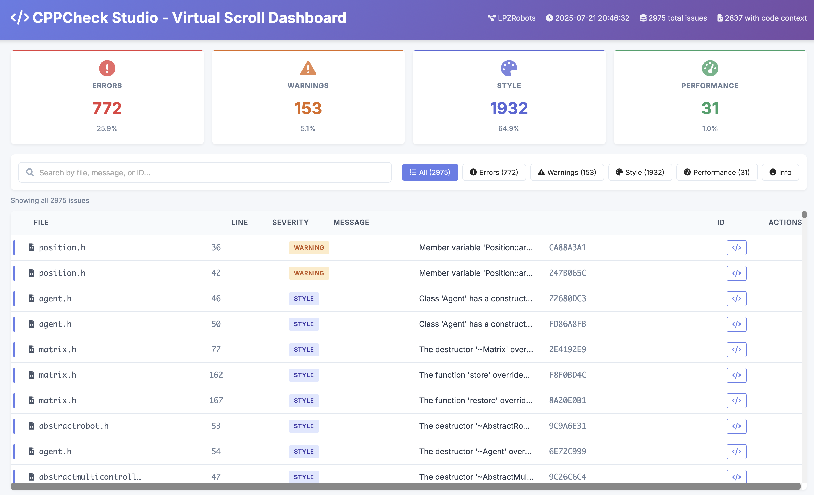
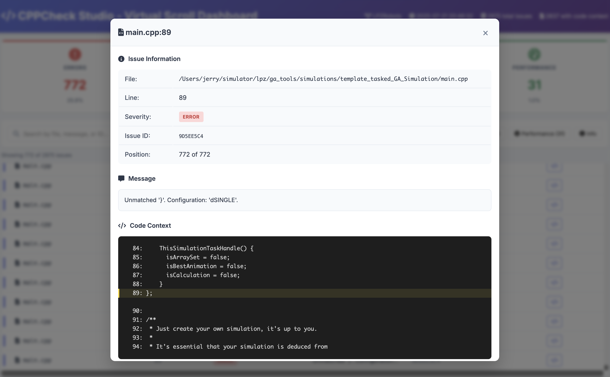

# CPPCheck Studio

<div align="center">
  
  
  **Professional C++ Static Analysis Studio**
  
  [](LICENSE)
  [](https://github.com/yourusername/cppcheck-studio/actions)
  [](https://www.npmjs.com/package/cppcheck-studio)
</div>

## 🚀 Overview

CPPCheck Studio transforms C++ static analysis into an interactive, visual experience. Built on top of the powerful cppcheck engine, it provides:

- 🎯 **Interactive Code Analysis** - Click any issue to see full context with syntax highlighting
- 🔄 **One-Click Fixes** - Preview and apply fixes with GitHub-style diffs
- 📊 **Beautiful Dashboards** - Visualize code quality metrics and trends
- 🛡️ **Safe & Reliable** - Every fix is validated, backed up, and reversible
- 🔌 **IDE Integration** - VS Code extension for seamless workflow
- 🚢 **CI/CD Ready** - GitHub Actions, GitLab CI, and Jenkins plugins

## 📸 Screenshots

<div align="center">
  
  <p><em>Interactive dashboard with real-time analysis</em></p>
  
  
  <p><em>GitHub-style diff viewer with one-click fixes</em></p>
</div>

## 🏃 Quick Start

### npm Package

```bash
# Install globally
npm install -g cppcheck-studio

# Start the studio
cppcheck-studio start

# Analyze a project
cppcheck-studio analyze /path/to/your/cpp/project
```

### Docker

```bash
docker run -p 3000:3000 -v /path/to/project:/workspace cppcheck-studio
```

### From Source

```bash
# Clone the repository
git clone https://github.com/yourusername/cppcheck-studio.git
cd cppcheck-studio

# Install dependencies
npm install

# Start development servers
npm run dev

# Open http://localhost:3000
```

## 🎯 Features

### Smart Analysis
- Powered by cppcheck with enhanced C++17/20 rules
- Incremental analysis for large codebases
- Real-time file watching
- Custom rule support

### Interactive Fixes
- Preview changes before applying
- Confidence scoring for each fix
- Batch operations with review
- Git integration for safe rollback

### Beautiful UI
- Monaco Editor for VS Code-like experience
- Syntax highlighting with multiple themes
- Keyboard shortcuts for power users
- Responsive design for all devices

### Enterprise Ready
- Multi-project support
- Team collaboration features
- Audit trail for all changes
- REST API for automation

## 🛠️ Technology Stack

- **Frontend**: Next.js 14, React 18, TypeScript
- **Backend**: Node.js, Express, Socket.io
- **Core**: TypeScript, cppcheck
- **UI**: Tailwind CSS, Radix UI, Monaco Editor
- **Data**: PostgreSQL, Redis, Bull Queue

## 📚 Documentation

- [Getting Started](docs/getting-started.md)
- [Configuration](docs/configuration.md)
- [API Reference](docs/api-reference.md)
- [Contributing](CONTRIBUTING.md)
- [Architecture](docs/architecture.md)

## 🤝 Contributing

We welcome contributions! Please see our [Contributing Guide](CONTRIBUTING.md) for details.

```bash
# Fork and clone the repo
git clone https://github.com/yourusername/cppcheck-studio.git

# Create a branch
git checkout -b feature/amazing-feature

# Make your changes and commit
git commit -m 'Add amazing feature'

# Push and create PR
git push origin feature/amazing-feature
```

## 📦 Project Structure

```
cppcheck-studio/
├── apps/
│   ├── web/          # Next.js frontend
│   └── api/          # Express backend
├── packages/
│   ├── core/         # Analysis engine
│   └── ui/           # Shared components
├── docs/             # Documentation
└── examples/         # Example projects
```

## 🔧 Configuration

Create a `.cppcheckstudio.json` in your project root:

```json
{
  "profile": "cpp17",
  "exclude": ["build/", "third_party/"],
  "customRules": ["./rules/"],
  "autoFix": true,
  "fixConfidence": 80
}
```

## 🚀 Deployment

### Vercel (Recommended)

[](https://vercel.com/new/clone?repository-url=https://github.com/yourusername/cppcheck-studio)

### Self-Hosted

```bash
# Build for production
npm run build

# Start production servers
npm run start
```

## 📝 License

MIT © [CPPCheck Studio Team](LICENSE)

## 🙏 Acknowledgments

- [cppcheck](http://cppcheck.net/) - The amazing static analysis engine
- [LPZRobots](https://github.com/georgmartius/lpzrobots) - Initial inspiration
- All our [contributors](https://github.com/yourusername/cppcheck-studio/graphs/contributors)

---

<div align="center">
  Made with ❤️ for the C++ community
  
  [Website](https://cppcheck.studio) • [Documentation](https://docs.cppcheck.studio) • [Discord](https://discord.gg/cppcheck)
</div>