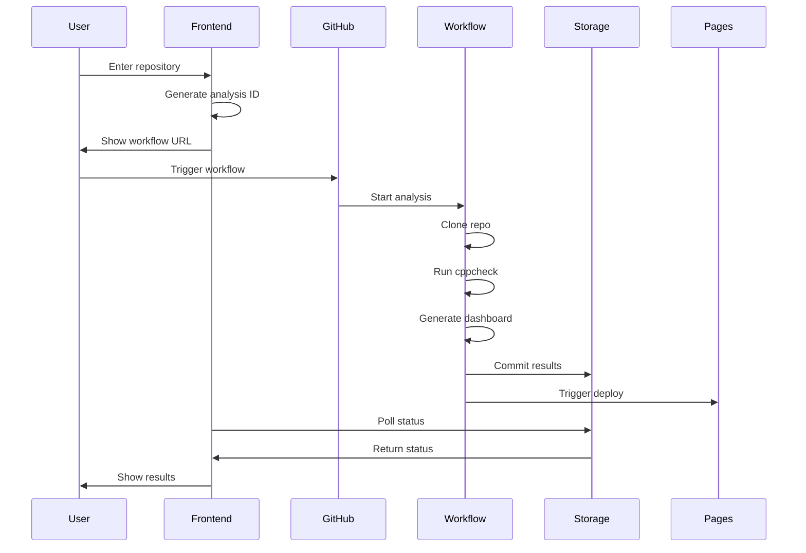

# CPPCheck Studio - Complete Technical Reference

## 📚 Table of Contents

1. [System Architecture](#system-architecture)
2. [Component Details](#component-details)
3. [Workflow Specifications](#workflow-specifications)
4. [API Reference](#api-reference)
5. [Error Catalog](#error-catalog)
6. [Code Examples](#code-examples)
7. [Troubleshooting Guide](#troubleshooting-guide)
8. [Performance Metrics](#performance-metrics)

## 🏗️ System Architecture

### Overall Design

```
┌─────────────────────────────────────────────────────────────────┐
│                        GitHub Pages Frontend                      │
│  ┌─────────────┐  ┌──────────────┐  ┌─────────────────────┐   │
│  │ index.html  │  │ gallery.html │  │ simple-trigger.js   │   │
│  └─────────────┘  └──────────────┘  └─────────────────────┘   │
└────────────────────────────┬────────────────────────────────────┘
                             │
                             ▼
┌─────────────────────────────────────────────────────────────────┐
│                    GitHub Actions Workflows                       │
│  ┌──────────────────┐  ┌────────────────┐  ┌───────────────┐   │
│  │ analyze-on-demand│  │ deploy-docs    │  │ check-deploy  │   │
│  └──────────────────┘  └────────────────┘  └───────────────┘   │
└─────────────────────────────────────────────────────────────────┘
                             │
                             ▼
┌─────────────────────────────────────────────────────────────────┐
│                     Data Storage (Git Repo)                       │
│  ┌──────────┐  ┌──────────┐  ┌──────────┐  ┌──────────────┐   │
│  │ results/ │  │ api/     │  │ status/  │  │ analyses/    │   │
│  └──────────┘  └──────────┘  └──────────┘  └──────────────┘   │
└─────────────────────────────────────────────────────────────────┘
```

### Data Flow

1. **User Input** → Web Interface
2. **Trigger Generation** → Unique Analysis ID
3. **Manual Dispatch** → GitHub Actions
4. **Analysis Execution** → CPPCheck + Dashboard Generation
5. **Result Storage** → Git Repository
6. **Deployment** → GitHub Pages
7. **Status Polling** → Frontend Updates

## 📦 Component Details

### Frontend Components

#### index.html
**Purpose**: Main user interface for triggering analyses

**Key Features**:
- Repository input field with validation
- Analysis button with loading states
- Modal dialog for workflow instructions
- History tracking via localStorage
- Real-time status polling

**Code Structure**:
```javascript
// Core functions
function analyzeRepository() {
  const repo = document.getElementById('repoInput').value.trim();
  const trigger = new SimpleTrigger();
  trigger.triggerAnalysis(repo).then(result => {
    showTriggerModal(result);
    pollAnalysisStatus(result.analysisId);
  });
}

function pollAnalysisStatus(analysisId) {
  const interval = setInterval(async () => {
    const status = await checkAnalysisStatus(analysisId);
    updateStatusDisplay(status);
    if (status.completed) clearInterval(interval);
  }, 5000);
}
```

#### simple-trigger.js
**Purpose**: Handles analysis triggering and status tracking

**Key Methods**:
- `triggerAnalysis(repository)`: Generates unique ID and workflow URL
- `checkAnalysisStatus(analysisId)`: Polls multiple endpoints for status
- `saveToHistory(analysis)`: Persists to localStorage
- `generateWorkflowUrl(repo, analysisId)`: Creates GitHub Actions URL

**Unique ID Format**: `{timestamp}-{random}`
- Example: `1753188976457-89qbltmpe`
- Timestamp: milliseconds since epoch
- Random: 9-character alphanumeric

#### gallery.html
**Purpose**: Displays all completed analyses

**Features**:
- Sortable table of analyses
- Search functionality
- Direct links to dashboards
- Repository filtering
- Issue count display

### Backend Components

#### TypeScript Dashboard Generator
**Location**: `/cppcheck-dashboard-generator/`

**Fixed Bug**:
```typescript
// BEFORE (broken):
const issuesJsonl = issues.map(issue => JSON.stringify(issue)).join('\\n');

// AFTER (fixed):
const issuesJsonl = issues.map(issue => JSON.stringify(issue)).join('\n');
```

**Key Files**:
- `src/generator.ts`: Main dashboard generation logic
- `src/types.ts`: TypeScript interfaces
- `src/templates/`: HTML templates

### GitHub Actions Workflows

#### analyze-on-demand.yml
**Purpose**: Main analysis workflow

**Inputs**:
```yaml
inputs:
  repository:
    description: 'GitHub repository to analyze (owner/repo)'
    required: true
    type: string
  analysis_id:
    description: 'Unique analysis ID for tracking'
    required: false
    type: string
  branch:
    description: 'Branch to analyze'
    required: false
    type: string
    default: 'main'
  max_files:
    description: 'Maximum files to analyze'
    required: false
    type: number
    default: 500
```

**Key Steps**:
1. Parse inputs and generate IDs
2. Clone target repository
3. Auto-detect default branch if needed
4. Find C++ files (with filters)
5. Run cppcheck analysis
6. Convert XML to JSON
7. Add code context
8. Generate HTML dashboard
9. Store results and update API
10. Trigger deployment

#### deploy-docs.yml
**Purpose**: GitHub Pages deployment with self-healing

**Triggers**:
```yaml
on:
  push:
    branches: [ main ]
  workflow_dispatch:
  schedule:
    - cron: '0 */2 * * *'  # Every 2 hours
  workflow_run:
    workflows: ["*"]
    types: [completed]
```

**Self-Healing Features**:
- No path restrictions (deploys on ANY change)
- Scheduled deployments prevent expiration
- Triggers after any workflow completion
- Manual dispatch available

#### check-deployment.yml
**Purpose**: Monitor and auto-fix GitHub Pages

**Features**:
```yaml
- name: Check site status
  run: |
    STATUS=$(curl -s -o /dev/null -w "%{http_code}" $SITE_URL)
    if [ "$STATUS" != "200" ]; then
      # Trigger deployment
      gh workflow run deploy-docs.yml
      # Create issue
      gh issue create --title "Site Down: $STATUS"
    fi
```

## 📋 Workflow Specifications

### Complete Analysis Flow



### File Detection Logic

```bash
find . -type f \( \
  -name "*.cpp" -o \
  -name "*.cc" -o \
  -name "*.cxx" -o \
  -name "*.c" -o \
  -name "*.h" -o \
  -name "*.hpp" \
\) \
-not -path "*/build/*" \
-not -path "*/.git/*" \
-not -path "*/vendor/*" \
-not -path "*/third_party/*" \
| head -n $MAX_FILES
```

### Branch Detection

```bash
# Auto-detect default branch
DEFAULT_BRANCH=$(curl -s https://api.github.com/repos/$REPO | jq -r .default_branch)
if [ "$DEFAULT_BRANCH" != "null" ] && [ -n "$DEFAULT_BRANCH" ]; then
  BRANCH=$DEFAULT_BRANCH
else
  BRANCH="main"
fi
```

## 🔌 API Reference

### Endpoints

#### `/api/gallery.json`
**Purpose**: List of all analyses

**Format**:
```json
{
  "analyses": [
    {
      "analysis_id": "1753188976457-89qbltmpe",
      "repository": "nlohmann/json",
      "branch": "develop",
      "commit": "abc123",
      "timestamp": "2025-01-22T10:30:00Z",
      "files_analyzed": 150,
      "issues_found": 87,
      "dashboard_url": "https://..."
    }
  ]
}
```

#### `/api/status/{analysis_id}.json`
**Purpose**: Real-time analysis status

**Format**:
```json
{
  "analysis_id": "1753188976457-89qbltmpe",
  "repository": "nlohmann/json",
  "status": "running|completed|failed",
  "workflow_run_id": "7891234567",
  "workflow_run_url": "https://github.com/...",
  "updated_at": "2025-01-22T10:30:00Z",
  "message": "Analysis in progress...",
  "files_analyzed": 150,
  "issues_found": 87,
  "dashboard_url": "https://..."
}
```

#### `/api/analyses/{analysis_id}.json`
**Purpose**: Detailed analysis metadata

**Format**: Same as gallery entry

### JavaScript API

#### SimpleTrigger Class

```javascript
class SimpleTrigger {
  constructor() {
    this.baseUrl = 'https://jerryzhao173985.github.io/cppcheck-studio';
    this.history = this.loadHistory();
  }

  async triggerAnalysis(repository) {
    const analysisId = this.generateAnalysisId();
    const workflowUrl = this.generateWorkflowUrl(repository, analysisId);
    
    this.saveToHistory({
      analysisId,
      repository,
      triggeredAt: new Date().toISOString(),
      status: 'pending'
    });
    
    return { analysisId, workflowUrl, repository };
  }

  async checkAnalysisStatus(analysisId) {
    // Check multiple endpoints
    const [status, gallery, analysis] = await Promise.all([
      this.fetchJson(`/api/status/${analysisId}.json`),
      this.fetchJson('/api/gallery.json'),
      this.fetchJson(`/api/analyses/${analysisId}.json`)
    ]);
    
    return this.consolidateStatus(status, gallery, analysis);
  }
}
```

## 🚨 Error Catalog

### Workflow Errors

#### 1. npm link Error
```
npm error code ELINKGLOBAL
npm error link should never be --global
```
**Fix**: Remove `-g` flag from `npm link` command

#### 2. Branch Not Found
```
fatal: Remote branch main not found in upstream origin
```
**Fix**: Auto-detect default branch via GitHub API

#### 3. Permission Denied
```
Permission denied to github-actions[bot]
```
**Fix**: Add permissions block to workflow:
```yaml
permissions:
  contents: write
  pages: write
  id-token: write
```

#### 4. Git Authentication
```
fatal: could not read Username for 'https://github.com'
```
**Fix**: Use token authentication:
```bash
git clone https://x-access-token:${{ secrets.GITHUB_TOKEN }}@github.com/...
```

### Frontend Errors

#### 1. JSONL Format Error
**Symptom**: Dashboard shows "nothing issue or no data"
**Fix**: Use actual newlines (`\n`) not escaped (`\\n`)

#### 2. 404 Errors
**Symptom**: GitHub Pages returns 404
**Fix**: Self-healing deployment system

#### 3. Status Not Found
**Symptom**: Polling returns 404 for status
**Fix**: Wait for workflow to create status file

## 💻 Code Examples

### Triggering Analysis Programmatically

```javascript
// Using fetch API
const triggerAnalysis = async (repo) => {
  const analysisId = `${Date.now()}-${Math.random().toString(36).substr(2, 9)}`;
  
  // Note: Direct API calls blocked by CORS
  // Must use manual workflow dispatch
  console.log(`
    1. Go to: https://github.com/jerryzhao173985/cppcheck-studio/actions
    2. Click "Run workflow"
    3. Enter:
       - Repository: ${repo}
       - Analysis ID: ${analysisId}
  `);
  
  return analysisId;
};
```

### Monitoring Analysis

```javascript
const monitorAnalysis = async (analysisId) => {
  const checkStatus = async () => {
    try {
      const response = await fetch(
        `https://jerryzhao173985.github.io/cppcheck-studio/api/status/${analysisId}.json`
      );
      
      if (response.ok) {
        const status = await response.json();
        console.log(`Status: ${status.status}`);
        
        if (status.status === 'completed') {
          console.log(`Dashboard: ${status.dashboard_url}`);
          return true;
        }
      }
    } catch (e) {
      console.log('Still processing...');
    }
    return false;
  };
  
  // Poll every 5 seconds
  const interval = setInterval(async () => {
    if (await checkStatus()) {
      clearInterval(interval);
    }
  }, 5000);
};
```

### Custom Dashboard Generation

```bash
# Clone the repository
git clone https://github.com/jerryzhao173985/cppcheck-studio.git
cd cppcheck-studio

# Install dependencies
cd cppcheck-dashboard-generator
npm install
npm run build
npm link
cd ..

# Run analysis
cppcheck --enable=all --xml --xml-version=2 /path/to/code 2> results.xml
python3 xml2json-simple.py results.xml > analysis.json
python3 add-code-context.py analysis.json analysis-with-context.json

# Generate dashboard
cppcheck-dashboard analysis-with-context.json dashboard.html \
  --title "My Project Analysis" \
  --project "MyProject v1.0"
```

## 🔧 Troubleshooting Guide

### Common Issues

#### Site Shows 404

**Symptoms**:
- https://jerryzhao173985.github.io/cppcheck-studio/ returns 404
- New deployments don't appear

**Solutions**:
1. Wait 2 hours (auto-deployment will run)
2. Manual fix: `gh workflow run deploy-docs.yml`
3. Check deployment status: Actions → deploy-docs workflow

#### Analysis Not Appearing

**Symptoms**:
- Triggered analysis but no results
- Status shows "analyzing" forever

**Debug Steps**:
1. Check workflow run: https://github.com/jerryzhao173985/cppcheck-studio/actions
2. Look for your analysis ID in recent runs
3. Check workflow logs for errors
4. Verify repository is public
5. Check if C++ files were found

#### Workflow Fails

**Common Causes**:
1. Repository doesn't exist or is private
2. Branch name incorrect
3. No C++ files found
4. CPPCheck crash (rare)

**Debug Commands**:
```bash
# Test repository access
curl -s https://api.github.com/repos/OWNER/REPO | jq .default_branch

# Test file detection locally
find . -name "*.cpp" -o -name "*.h" | head -10

# Check workflow permissions
gh api repos/jerryzhao173985/cppcheck-studio/actions/permissions
```

### Advanced Debugging

#### Enable Debug Logging

Add to workflow:
```yaml
env:
  ACTIONS_RUNNER_DEBUG: true
  ACTIONS_STEP_DEBUG: true
```

#### Local Testing

```bash
# Test the complete flow locally
./scripts/test-workflow.sh nlohmann/json

# Test specific components
python3 add-code-context.py test.json output.json
python3 generate-ultimate-dashboard.py test.json dashboard.html
```

#### Check Deployment Health

```bash
# Site status
curl -I https://jerryzhao173985.github.io/cppcheck-studio/

# API status
curl https://jerryzhao173985.github.io/cppcheck-studio/api/gallery.json

# Recent analyses
curl https://jerryzhao173985.github.io/cppcheck-studio/api/gallery.json | jq '.analyses[0]'
```

## 📊 Performance Metrics

### Typical Analysis Times

| Repository Size | Files | Analysis Time | Dashboard Size |
|-----------------|-------|---------------|----------------|
| Small (<100)    | 50    | 1-2 min      | ~200KB        |
| Medium          | 200   | 2-4 min      | ~500KB        |
| Large           | 500   | 4-8 min      | ~1MB          |

### System Limits

- **Max Files**: 500 (configurable)
- **Max Issues**: ~10,000 (with virtual scroll)
- **Dashboard Size**: ~2MB practical limit
- **Analysis Time**: 10 minute GitHub Actions limit

### Optimization Tips

1. **Reduce File Count**:
   ```yaml
   max_files: 100  # Analyze only first 100 files
   ```

2. **Target Specific Directories**:
   ```bash
   # In workflow, modify find command
   find src/ -name "*.cpp"  # Only src directory
   ```

3. **Use Virtual Scroll Dashboard**:
   ```bash
   python3 generate-virtual-scroll-dashboard.py large-analysis.json output.html
   ```

4. **Skip Code Context**:
   ```bash
   # Skip add-code-context.py step for faster generation
   ```

## 🔒 Security Considerations

### Current Limitations

1. **Public Repositories Only**: No private repo support
2. **No Authentication**: Results are publicly accessible
3. **CORS Restrictions**: Cannot trigger from browser
4. **Read-Only**: No code modifications

### Best Practices

1. **Don't Analyze Sensitive Code**: All results are public
2. **Use Unique IDs**: Prevents analysis ID collisions
3. **Monitor Usage**: Check GitHub Actions usage limits
4. **Clean Old Results**: Periodically remove old analyses

### Future Security Enhancements

1. **Private Repository Support**: OAuth integration
2. **Access Control**: Password-protected dashboards
3. **Encrypted Storage**: For sensitive results
4. **Rate Limiting**: Prevent abuse

---

*This technical reference represents the complete implementation as of January 22, 2025.*